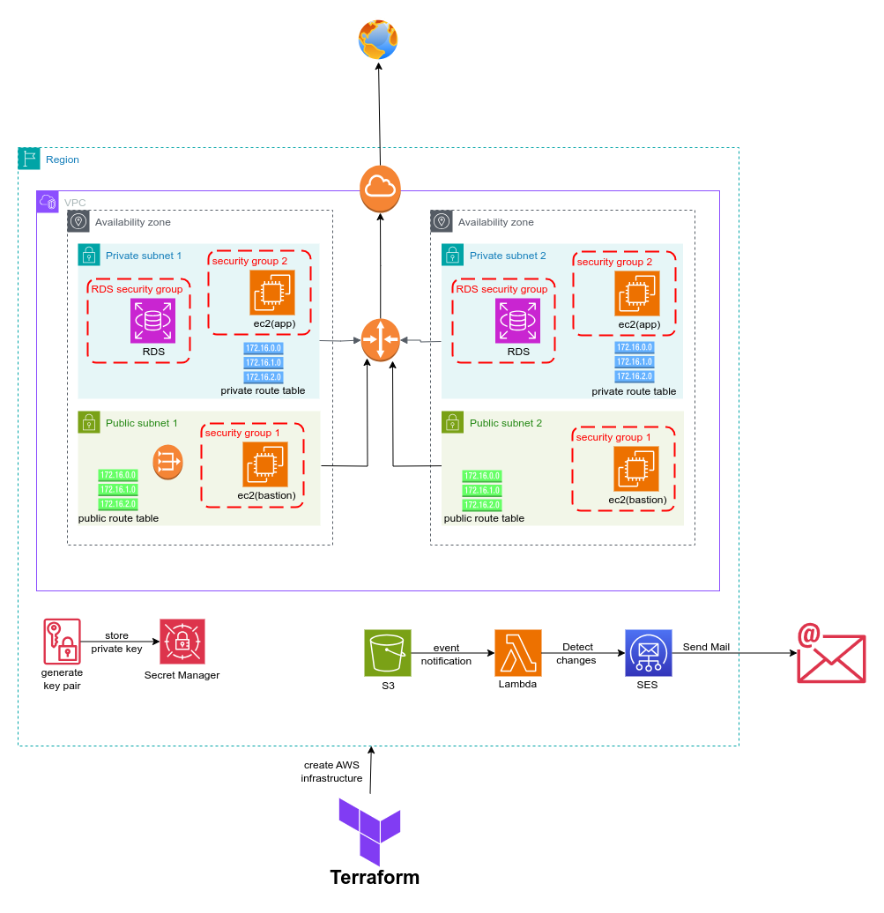

## Build an AWS Cloud infrastructure using Terraform
Deployed a VPC with subnets, EC2 instances, RDS, and Elastic Cache using Terraform modules. Stored
the EC2 private key in Secret Manager, stored the state file on S3, triggered a lambda function to send
email on updates, and stored process info in DynamoDB. Created workspaces for dev/prod and
deployed them to multiple regions.

## aws architecture
